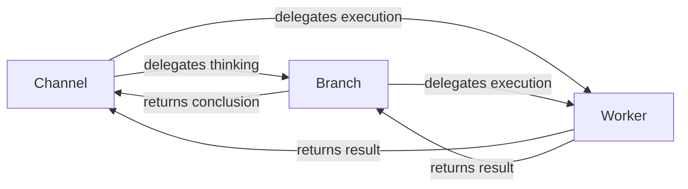

Spacebot's multi-agent system has two kinds of subordinate processes: **branches** and **workers**. Channels delegate to branches for thinking. Branches and channels delegate to workers for execution.

## Process Type Overview



## Branches

A branch is a fork of a channel's context that goes off to think.

### What Branches Do

Branches:
- Start with a **clone** of the channel's full conversation history
- Search and curate memories
- Reason about complex questions
- Spawn workers when needed
- Return a clean conclusion to the channel
- Get deleted after completing

### Branch Construction

```rust
// From src/agent/branch.rs
pub struct Branch {
    pub id: BranchId,
    pub channel_id: ChannelId,
    pub description: String,
    pub deps: AgentDeps,
    pub hook: SpacebotHook,
    pub system_prompt: String,
    pub history: Vec<rig::message::Message>,
    pub tool_server: ToolServerHandle,
    pub max_turns: usize,
}
```

Creating a branch is cheap:

```rust
// From src/agent/channel.rs
let branch_history = channel_history.clone();

let branch = Branch::new(
    channel_id.clone(),
    "search memories about X",
    deps.clone(),
    system_prompt,
    branch_history,  // Clone of channel's history
    tool_server,
    10,  // max_turns
);
```

### Branch Tools

Branches have an isolated `ToolServer` with memory tools:

| Tool | Purpose |
|------|--------|
| `memory_recall` | Hybrid search (vector + FTS + RRF + graph) |
| `memory_save` | Create structured memories |
| `channel_recall` | Read transcripts from other conversations |
| `spawn_worker` | Create workers for execution tasks |

<Info>
  Branches have `memory_recall`, channels do not. This keeps memory search off the channel's tool list entirely and ensures all memory access goes through curation.
</Info>

### Memory Recall Flow

```rust
// Branch uses memory_recall tool
{
  "name": "memory_recall",
  "input": {
    "query": "user's preferences about code style",
    "memory_types": ["preference", "decision"],
    "limit": 10
  }
}

// Hybrid search runs:
// 1. Vector similarity (embeddings via HNSW)
// 2. Full-text search (Tantivy)
// 3. RRF merge (Reciprocal Rank Fusion)
// 4. Graph traversal for related memories

// Branch receives curated results
// Branch synthesizes into conclusion
// Returns to channel: "User prefers tabs over spaces..."
```

The channel never sees raw search results. It gets clean conclusions.

### Branch Lifecycle

<Steps>
  <Step title="Channel spawns branch">
    ```rust
    tokio::spawn(async move {
        let conclusion = branch.run(prompt).await?;
        // Send conclusion back to channel via ProcessEvent
    });
    ```
  </Step>
  
  <Step title="Branch thinks independently">
    Operates on its cloned history. Channel can respond to other messages while branch runs.
  </Step>
  
  <Step title="Branch returns conclusion">
    ```rust
    let conclusion = agent.prompt(&prompt)
        .with_history(&mut self.history)
        .with_hook(self.hook.clone())
        .await?;
    ```
  </Step>
  
  <Step title="Branch is deleted">
    No cleanup needed — just drops. History clone is discarded.
  </Step>
</Steps>

### Concurrent Branches

Multiple branches run simultaneously:

```rust
// From src/agent/channel.rs
const MAX_CONCURRENT_BRANCHES: usize = 3;
```

First done, first incorporated. Results arrive as `ProcessEvent::BranchComplete` events.

### Context Overflow Handling

Branches inherit large channel histories and can overflow on first call:

```rust
// From src/agent/branch.rs
const MAX_OVERFLOW_RETRIES: usize = 2;

// Pre-flight compaction
self.maybe_compact_history();

// Retry loop with compaction on overflow
match agent.prompt(&prompt).with_history(&mut history).await {
    Err(error) if is_context_overflow_error(&error.to_string()) => {
        self.force_compact_history();
        current_prompt = "Continue where you left off. Older context has been compacted.".into();
    }
}
```

## Workers

Workers are independent processes that do jobs. Two kinds:

### Fire-and-Forget Workers

Do a job and return a result:

```rust
tokio::spawn(async move {
    let result = worker.run().await?;
    // Send result via ProcessEvent::WorkerComplete
});
```

**Use cases:**
- Memory recall (deprecated, now done in branches)
- Summarization
- One-shot file operations
- Quick searches

### Interactive Workers

Long-running, accept follow-up input:

```rust
// From src/agent/worker.rs
let (worker, input_tx) = Worker::new_interactive(
    channel_id,
    "Refactor authentication module",
    system_prompt,
    deps,
    browser_config,
    screenshot_dir,
    brave_search_key,
    logs_dir,
);

// User sends follow-up
input_tx.send("also update the tests").await?;
```

**Use cases:**
- Coding sessions
- Multi-step research
- Interactive debugging
- Long conversations with OpenCode workers

### Worker Construction

```rust
// From src/agent/worker.rs
pub struct Worker {
    pub id: WorkerId,
    pub channel_id: Option<ChannelId>,
    pub task: String,
    pub state: WorkerState,
    pub deps: AgentDeps,
    pub hook: SpacebotHook,
    pub system_prompt: String,
    pub input_rx: Option<mpsc::Receiver<String>>,
    pub browser_config: BrowserConfig,
    pub screenshot_dir: PathBuf,
    pub brave_search_key: Option<String>,
    pub logs_dir: PathBuf,
    pub status_tx: watch::Sender<String>,
    pub status_rx: watch::Receiver<String>,
}
```

### Worker State Machine

```rust
// From src/agent/worker.rs
pub enum WorkerState {
    Running,
    WaitingForInput,  // Interactive only
    Done,
    Failed,
}
```

State transitions:

```
Running -> WaitingForInput -> Running -> Done
Running -> Failed
Running -> Done
```

### Worker Tools

Workers get task-specific tools:

| Tool | Purpose |
|------|--------|
| `shell` | Execute shell commands with configurable timeouts |
| `file` | Read, write, list files with workspace isolation |
| `exec` | Run specific programs with arguments and env vars |
| `browser` | Headless Chrome automation with accessibility tree |
| `web_search` | Brave Search API integration |
| `set_status` | Update worker status (visible to channel) |

MCP tools are also available if configured:

```toml
[[mcp_servers]]
name = "filesystem"
transport = "stdio"
command = "npx"
args = ["-y", "@modelcontextprotocol/server-filesystem", "/workspace"]
```

Tools are discovered via MCP protocol and registered with namespaced names (`filesystem_read_file`).

### Worker Context

Workers get:

```
[System Prompt]
You are a specialized worker for [task type].

[Temporal Context]
Current time: 2024-03-15 14:30:00 (America/New_York, UTC-04:00)
UTC: 2024-03-15 18:30:00 UTC

[Task]
{task_description}

[Available Tools]
{tools}
```

Workers do **not** get:
- Channel conversation history
- Agent personality or soul
- Memory bulletin
- Identity files

They're stateless task executors.

### Worker Segmentation

```rust
// From src/agent/worker.rs
const TURNS_PER_SEGMENT: usize = 25;
const MAX_SEGMENTS: usize = 10;
```

Workers run in segments. After 25 turns:
1. Check context size
2. Compact if needed
3. Continue or return partial result

This prevents unbounded growth and runaway workers.

### Status Updates

Workers report status via the `set_status` tool:

```json
{
  "name": "set_status",
  "input": {
    "status": "refactoring auth module (3/5 files complete)"
  }
}
```

Channel sees this in its status block:

```rust
// From src/agent/status.rs
pub struct WorkerStatus {
    pub id: WorkerId,
    pub task: String,
    pub status: String,
    pub started_at: DateTime<Utc>,
    pub notify_on_complete: bool,
    pub tool_calls: usize,
}
```

### Worker Backends

Workers are pluggable. Built-in types:

**Built-in Rig workers** — Rig `Agent` with shell/file/exec/browser tools

**OpenCode workers** — Spawns OpenCode as a persistent subprocess:

```rust
// OpenCode worker spawned as child process
let worker = OpenCodeWorker::spawn(
    task,
    workspace_dir,
    opencode_config,
).await?;

// User sends follow-up
worker.send_message("update the tests too").await?;
```

OpenCode brings its own codebase exploration, LSP awareness, and context management.

See [OpenCode Integration](/features/opencode) for details.

### Sandbox Isolation

Workers execute arbitrary code on your behalf. Defense-in-depth:

**Process sandbox** — On Linux, bubblewrap creates a mount namespace where the entire filesystem is read-only except the workspace and configured writable paths. On macOS, `sandbox-exec` enforces equivalent restrictions.

```toml
[agents.sandbox]
mode = "enabled"  # or "disabled"
writable_paths = ["/home/user/projects/myapp"]
```

**Workspace isolation** — File tools canonicalize all paths and reject anything outside the workspace. Symlinks that escape are blocked.

**Leak detection** — Scans tool arguments and results for secrets (API keys, tokens, PEM keys) across plaintext, URL-encoded, base64, and hex encodings.

**SSRF protection** — Browser tool blocks cloud metadata endpoints, private IPs, loopback, link-local addresses.

### Error Handling

Workers fail gracefully:

```rust
// Tool errors are returned as results, not panics
{
  "name": "shell",
  "output": {
    "error": "command not found: nonexistent-command",
    "exit_code": 127
  }
}
```

The LLM sees the error and can retry, adjust, or give up.

On worker failure, logs are written to `logs_dir` for debugging:

```rust
// From src/agent/worker.rs
if state == WorkerState::Failed {
    let log_path = self.logs_dir.join(format!("worker-{}.log", self.id));
    tokio::fs::write(log_path, full_transcript).await?;
}
```

## Status Injection

Channels see live status of all branches and workers:

```rust
// From src/agent/status.rs
pub struct StatusBlock {
    pub active_branches: Vec<BranchStatus>,
    pub active_workers: Vec<WorkerStatus>,
    pub completed_items: Vec<CompletedItem>,
}
```

Example context injection:

```
# Active Work

## Branches
- [branch-a1b2c3d4] Searching memories about user's code style preferences (running 2s)

## Workers
- [worker-e5f6g7h8] Refactoring auth module (status: analyzing dependencies, 12 tool calls)

## Recently Completed
- [worker-i9j0k1l2] Research task about API design patterns (completed 30s ago)
  Result: Found 3 relevant patterns...
```

Short branches (less than 3 seconds) are invisible to reduce noise.

## Model Routing

Processes use different models based on their role:

```toml
[defaults.routing]
channel = "anthropic/claude-sonnet-4"  # Best conversational model
branch = "anthropic/claude-sonnet-4"   # Same, needs reasoning
worker = "anthropic/claude-haiku-4.5"  # Fast and cheap
compactor = "anthropic/claude-haiku-4.5"  # Cheap summarization
cortex = "anthropic/claude-haiku-4.5"  # Cheap bulletin generation

[defaults.routing.task_overrides]
coding = "anthropic/claude-sonnet-4"  # Upgrade coding workers
```

See [Model Routing](/core/routing) for details.

## Best Practices

<Accordion title="When to use branches vs workers">
  **Use branches when:**
  - You need to search memories
  - You need to reason about something
  - You need the full conversation context
  - You want to make a decision before acting
  
  **Use workers when:**
  - You need to execute code
  - You need to browse the web
  - You need to run shell commands
  - You need to do multi-step task execution
</Accordion>

<Accordion title="When to make workers interactive">
  **Fire-and-forget workers:**
  - One-shot summarization
  - Quick file operations
  - Short research tasks
  
  **Interactive workers:**
  - Coding sessions (user might send follow-ups)
  - Multi-step debugging
  - Long research projects
  - Anything where you expect back-and-forth
</Accordion>

<Accordion title="How to prevent runaway workers">
  Workers have built-in safeguards:
  
  1. **Segmentation** — After 25 turns, check context and compact
  2. **Max segments** — Give up after 10 segments (250 turns)
  3. **Max turns per segment** — LLM can't loop forever
  4. **Context overflow recovery** — Compact and retry on overflow
  
  If a worker is stuck:
  ```json
  {
    "name": "cancel",
    "input": {
      "worker_id": "550e8400-e29b-41d4-a716-446655440000"
    }
  }
  ```
</Accordion>

## Next Steps

<CardGroup cols={2}>
  <Card title="Memory System" icon="brain" href="/core/memory">
    Learn how branches search and save memories
  </Card>
  <Card title="Tools Reference" icon="wrench" href="/features/tools">
    See all available worker tools
  </Card>
  <Card title="OpenCode Workers" icon="code" href="/features/opencode">
    Use OpenCode as a worker backend
  </Card>
  <Card title="Model Routing" icon="route" href="/core/routing">
    Configure models per process type
  </Card>
</CardGroup>