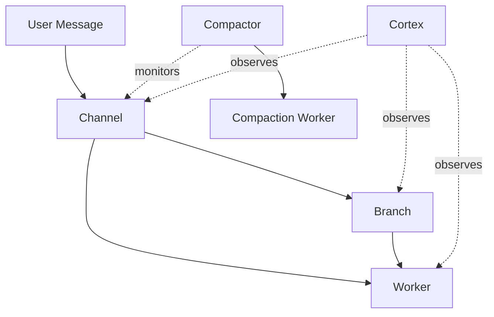

Spacebot replaces the monolithic session model with specialized processes that only do one thing. No single LLM thread handles conversation, thinking, tool execution, memory retrieval, and compaction. Instead, five process types delegate to each other.

## The Core Problem

Most AI agent frameworks run everything in a single session. One LLM thread handles:
- Conversation with the user
- Thinking and planning
- Tool execution
- Memory retrieval
- Context compaction

When it's doing work, it can't talk to you. When it's compacting, it goes dark. When it retrieves memories, raw results pollute the context with noise.

Spacebot splits the monolith into specialized processes. Each process has a dedicated role. Delegation is the only way work gets done.

## Five Process Types



### Process Comparison

| Process | Type | Tools | Context | Lifecycle |
|---------|------|-------|---------|----------|
| **Channel** | LLM | reply, branch, spawn_worker, route, cancel, skip, react | Conversation history + compaction summaries + status block | Persistent |
| **Branch** | LLM | memory_recall, memory_save, channel_recall, spawn_worker | Clone of channel's history at fork time | Short-lived |
| **Worker** | Pluggable | shell, file, exec, browser, set_status | Fresh prompt + task description | Fire-and-forget or interactive |
| **Compactor** | Programmatic | Monitor context, trigger workers | N/A | Persistent |
| **Cortex** | LLM + Programmatic | memory_recall, memory_save, system monitoring | Entire agent scope | Persistent |

## Message Flow

Here's how a typical user message flows through the system:

<Steps>
  <Step title="User sends message">
    The message arrives via a messaging adapter (Discord, Slack, Telegram, etc.) and routes to the channel.
  </Step>
  
  <Step title="Channel receives it">
    The channel decides what to do. It doesn't execute tasks directly or search memories itself.
  </Step>
  
  <Step title="Channel branches to think">
    The channel creates a branch — a fork of its full conversation context.
    
    ```rust
    // From src/agent/channel.rs
    let branch_history = channel_history.clone();
    ```
    
    The branch operates independently. The channel can respond to other messages while the branch thinks.
  </Step>
  
  <Step title="Branch recalls memories">
    The branch uses `memory_recall` to search the memory graph.
    
    Hybrid search combines:
    - Vector similarity (embeddings via HNSW)
    - Full-text search (Tantivy)
    - Reciprocal Rank Fusion (RRF) for merging
    - Graph traversal for related memories
    
    The branch curates results. The channel never sees raw search output.
  </Step>
  
  <Step title="Branch might spawn a worker">
    If the user's request needs heavy lifting (code a feature, research a topic, browse the web), the branch spawns a worker.
    
    Workers get:
    - A fresh prompt
    - A specific task description
    - Task-appropriate tools (shell, file, exec, browser)
    - No channel context, no soul, no personality
  </Step>
  
  <Step title="Branch returns conclusion">
    The branch synthesizes its findings into a clean conclusion and returns it to the channel.
    
    ```rust
    // From src/agent/branch.rs
    let conclusion = branch.run(prompt).await?;
    ```
    
    The branch is then deleted.
  </Step>
  
  <Step title="Channel responds to user">
    The channel incorporates the branch result and responds. The user sees the final answer, not the working.
  </Step>
</Steps>

## Concurrent Operations

Channels never block. Multiple processes run simultaneously:

```
User A: "what do you know about X?"
    → Channel branches (branch-1)

User B: "hey, how's it going?"
    → Channel responds directly: "Going well! Working on something for A."

Branch-1 resolves: "Here's what I found about X: [curated memories]"
    → Channel sees the branch result on its next turn
    → Channel responds to User A with the findings
```

Multiple branches can run concurrently per channel (configurable limit). First done, first incorporated.

## Process Construction

Every LLM process is a Rig `Agent<SpacebotModel, SpacebotHook>`. They differ in system prompt, tools, history, and hooks.

### Channel

```rust
// From src/agent/channel.rs
let agent = AgentBuilder::new(model)
    .preamble(&system_prompt)
    .default_max_turns(5)
    .tool_server_handle(tools.clone())
    .build();

let response = agent.prompt(&user_message)
    .with_history(&mut history)
    .with_hook(hook.clone())
    .await?;
```

History is **external** — a persistent `Vec<Message>` stored in SQLite and passed on each call.

### Branch

```rust
// From src/agent/branch.rs
let branch_history = channel_history.clone();

let agent = AgentBuilder::new(model)
    .preamble(&system_prompt)
    .default_max_turns(10)
    .tool_server_handle(tool_server.clone())
    .build();

let conclusion = agent.prompt(&prompt)
    .with_history(&mut branch_history)
    .with_hook(hook.clone())
    .await?;
```

Branches have an isolated `ToolServer` with `memory_save` and `memory_recall`. This keeps memory tools off the channel's tool list entirely.

### Worker

Workers come in two flavors:

**Fire-and-forget** — Does a job and returns a result. Summarization, file operations, one-shot tasks.

**Interactive** — Long-running, accepts follow-up input from the channel. Coding sessions, multi-step tasks.

```rust
// From src/agent/worker.rs
let agent = AgentBuilder::new(model)
    .preamble(&system_prompt)
    .default_max_turns(50)  // Many iterations
    .tool_server_handle(tools.clone())
    .build();
```

Workers run in segments. After 25 turns, they check context size and compact if needed. This prevents unbounded growth.

## Status Injection

Every turn, the channel gets a live status block injected into its context:

```rust
// From src/agent/status.rs
pub struct StatusBlock {
    pub active_branches: Vec<BranchStatus>,
    pub active_workers: Vec<WorkerStatus>,
    pub completed_items: Vec<CompletedItem>,
}
```

Workers set their own status via the `set_status` tool:

```json
{
  "name": "set_status",
  "input": {
    "status": "analyzing codebase structure"
  }
}
```

Short branches are invisible (only appear if running >3s).

## Context Management

The compactor watches each channel's context size and triggers compaction before the channel fills up. See [Context Compaction](/core/compaction) for details.

## Memory Bulletin

The cortex generates a **memory bulletin** — a periodically refreshed, LLM-curated summary of the agent's knowledge. Every channel reads this on every turn via `ArcSwap`. See [Cortex System](/core/cortex) for details.

## Process Communication

Processes communicate via a broadcast channel:

```rust
// From src/hooks.rs
pub enum ProcessEvent {
    BranchStarted { branch_id, channel_id, description, started_at },
    BranchComplete { branch_id, channel_id, result },
    WorkerStarted { worker_id, channel_id, task, started_at },
    WorkerStatus { worker_id, channel_id, status },
    WorkerComplete { worker_id, channel_id, result, notify },
    // ...
}
```

The channel subscribes to events and updates its status block. The cortex observes all events system-wide.

## Tech Stack

| Layer | Technology |
|-------|------------|
| Language | Rust (edition 2024) |
| Async runtime | Tokio |
| LLM framework | Rig v0.30.0 |
| Relational data | SQLite (sqlx) |
| Vector + FTS | LanceDB |
| Key-value | redb |
| Embeddings | FastEmbed |

Single binary. No server dependencies. All data lives in embedded databases in a local directory.

## Why This Architecture

**Built for teams and communities** — A single-threaded agent breaks the moment two people talk at once. Spacebot's delegation model means it can think about User A's question, execute a task for User B, and respond to User C's small talk — all at the same time.

**Never blocks** — The channel is always responsive. No waiting on long-running tasks, memory searches, or context compaction.

**Clean separation of concerns** — Channels talk, branches think, workers execute. Each process has a focused role and the right tools for that role.

**Memory curation** — Branches curate memories before returning results. The channel gets clean conclusions, not 50 raw database rows polluting context.

**Scalable context management** — Compaction happens in the background. The channel never freezes while summarizing old messages.

Read more about the philosophy behind these choices in [Why Rust](/core/philosophy).