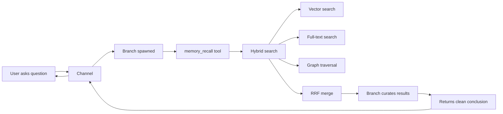

Spacebot's memory system is not markdown files. Not unstructured blocks in a vector database. It's a typed, graph-connected knowledge system — and this opinionated structure is why agents are productive out of the box.

Every memory has a type, an importance score, and graph edges connecting it to related memories. The agent doesn't just "remember things" — it knows the difference between a fact it learned, a decision that was made, a goal it's working toward, and a preference the user expressed.

## Memory Structure

```rust
// From src/memory/types.rs
pub struct Memory {
    pub id: String,
    pub content: String,
    pub memory_type: MemoryType,
    pub importance: f32,
    pub created_at: DateTime<Utc>,
    pub updated_at: DateTime<Utc>,
    pub last_accessed_at: DateTime<Utc>,
    pub access_count: i64,
    pub source: Option<String>,
    pub channel_id: Option<ChannelId>,
    pub forgotten: bool,
}
```

Each memory is:
- A row in **SQLite** with typed metadata and graph connections
- A vector embedding in **LanceDB** for similarity search
- A full-text indexed entry in **Tantivy** for keyword search

## Eight Memory Types

```rust
// From src/memory/types.rs
pub enum MemoryType {
    Fact,         // Something that is true
    Preference,   // Something the user likes or dislikes
    Decision,     // A choice that was made
    Identity,     // Core information about who the user is or who the agent is
    Event,        // Something that happened
    Observation,  // Something the system noticed
    Goal,         // Something the user or agent wants to achieve
    Todo,         // An actionable task or reminder
}
```

### Default Importance by Type

```rust
// From src/memory/types.rs
impl MemoryType {
    pub fn default_importance(&self) -> f32 {
        match self {
            MemoryType::Identity => 1.0,
            MemoryType::Goal => 0.9,
            MemoryType::Decision | MemoryType::Todo => 0.8,
            MemoryType::Preference => 0.7,
            MemoryType::Fact => 0.6,
            MemoryType::Event => 0.4,
            MemoryType::Observation => 0.3,
        }
    }
}
```

Identity memories have maximum importance (1.0) and never decay. Everything else degrades over time based on access patterns.

## Graph Edges

Memories connect to each other via typed relationships:

```rust
// From src/memory/types.rs
pub enum RelationType {
    RelatedTo,    // General semantic connection
    Updates,      // Newer version of the same information
    Contradicts,  // Conflicting information
    CausedBy,     // Causal relationship
    ResultOf,     // Result relationship
    PartOf,       // Hierarchical relationship
}
```

### Auto-Association

When a memory is created, it's automatically associated with similar memories:

```rust
// From src/memory/store.rs
// After saving to SQLite, search for similar memories
let similar = embedding_table.vector_search(&embedding, 5).await?;

for (existing_id, distance) in similar {
    let similarity = 1.0 - distance;
    
    if similarity > 0.9 {
        // Very similar — likely an update
        create_association(memory_id, existing_id, RelationType::Updates);
    } else if similarity > 0.7 {
        // Semantically related
        create_association(memory_id, existing_id, RelationType::RelatedTo);
    }
}
```

## Hybrid Search

Memory search combines four strategies:

<Steps>
  <Step title="Vector similarity search">
    Embed the query, find nearest neighbors via HNSW index in LanceDB.
    
    ```rust
    // From src/memory/search.rs
    let query_embedding = embedding_model.embed_one(query).await?;
    let vector_matches = embedding_table
        .vector_search(&query_embedding, max_results)
        .await?;
    ```
  </Step>
  
  <Step title="Full-text search">
    Use Tantivy inverted index for keyword matching.
    
    ```rust
    let fts_matches = embedding_table
        .text_search(query, max_results)
        .await?;
    ```
  </Step>
  
  <Step title="Graph traversal">
    Follow edges from top vector/FTS results to find related memories.
    
    ```rust
    let graph_results = store
        .traverse_graph(&seed_ids, max_depth)
        .await?;
    ```
  </Step>
  
  <Step title="Reciprocal Rank Fusion">
    Merge all results using RRF scoring.
    
    ```rust
    // RRF formula: score = sum(1 / (60 + rank))
    fn rrf_score(ranks: &[usize]) -> f64 {
        ranks.iter().map(|&r| 1.0 / (60.0 + r as f64)).sum()
    }
    ```
    
    RRF works on **ranks**, not raw scores. This lets us merge vector similarities, FTS scores, and graph weights fairly.
  </Step>
</Steps>

### Search Modes

```rust
// From src/memory/search.rs
pub enum SearchMode {
    Hybrid,     // Vector + FTS + graph + RRF (default)
    Recent,     // Most recent by created_at
    Important,  // Highest importance first
    Typed,      // Filter by MemoryType with configurable sort
}
```

**Hybrid search** is the default — used by branches when the user asks a question.

**Recent** and **Important** are metadata-only queries (no embeddings, no FTS).

**Typed** filters by `MemoryType` and sorts by `Recent`, `Importance`, or `MostAccessed`.

## Three Creation Paths

Memories are created three ways:

### 1. Branch-Initiated

During conversation, a branch uses the `memory_save` tool:

```json
{
  "name": "memory_save",
  "input": {
    "content": "User prefers tabs over spaces for indentation",
    "memory_type": "preference",
    "importance": 0.8
  }
}
```

The LLM decides what's worth remembering and how important it is.

### 2. Compactor-Initiated

During context compaction, the compactor worker extracts memories from summarized messages:

```rust
// From src/agent/compactor.rs
// Compaction worker has memory_save tool
let system_prompt = r#"
You are a compaction worker. Your job:
1. Summarize the provided conversation turns
2. Extract any memorable facts, decisions, or preferences
3. Save them using memory_save
"#;
```

This ensures context that gets compacted away is preserved as structured knowledge.

### 3. Cortex-Initiated

The cortex creates observations and consolidates memories system-wide:

```rust
// From src/agent/cortex.rs
// Cortex notices patterns across channels
if user_mentioned_timezone_3_times {
    memory_save(
        "User is based in America/New_York timezone",
        MemoryType::Identity,
        0.9
    );
}
```

## Recall Flow

Memory recall happens exclusively in branches:



The channel never sees raw search results. It gets clean, curated conclusions.

### Example Recall

```json
{
  "name": "memory_recall",
  "input": {
    "query": "user's preferences about code style",
    "memory_types": ["preference", "decision"],
    "limit": 10
  }
}
```

Returns:

```json
{
  "results": [
    {
      "content": "User prefers tabs over spaces for indentation",
      "memory_type": "preference",
      "importance": 0.8,
      "created_at": "2024-03-15T10:30:00Z",
      "score": 0.92
    },
    {
      "content": "Decided to use ESLint with Airbnb style guide",
      "memory_type": "decision",
      "importance": 0.75,
      "created_at": "2024-03-14T15:20:00Z",
      "score": 0.85
    }
  ]
}
```

The branch synthesizes these into:

> "You prefer tabs over spaces and have chosen the Airbnb ESLint style guide."

## Importance Scoring

Memory importance is influenced by:

**Explicit importance** — Set by the LLM or derived from memory type

**Access frequency** — Memories that are recalled often get boosted

```rust
// From src/memory/store.rs
pub async fn record_access(&self, id: &str) -> Result<()> {
    sqlx::query(
        "UPDATE memories SET last_accessed_at = ?, access_count = access_count + 1 WHERE id = ?"
    )
    .bind(chrono::Utc::now())
    .bind(id)
    .execute(&self.pool)
    .await?;
}
```

**Recency** — Recent memories score higher in search

**Graph centrality** — Memories with many connections are more important

### Decay

Non-identity memories decay over time:

```rust
// From src/memory/maintenance.rs
let decay_factor = 0.95;  // 5% decay per maintenance cycle

for memory in old_memories {
    if memory.memory_type != MemoryType::Identity {
        memory.importance *= decay_factor;
    }
}
```

Identity memories are exempt from decay.

## Memory Maintenance

Periodic background tasks keep the memory graph healthy:

### Decay

Reduce importance of old, unaccessed memories:

```rust
let cutoff = Utc::now() - Duration::days(30);
let old_memories = store.get_unaccessed_since(cutoff).await?;

for memory in old_memories {
    if memory.memory_type != MemoryType::Identity {
        memory.importance *= 0.95;
        store.update(&memory).await?;
    }
}
```

### Prune

Remove memories below importance threshold:

```rust
let threshold = 0.1;
let forgotten = store.get_by_importance_below(threshold).await?;

for memory in forgotten {
    store.forget(&memory.id).await?;
}
```

`forget()` sets `forgotten = true`. The memory stays in the database but is excluded from search.

### Merge

Detect near-duplicate memories and consolidate:

```rust
let duplicates = store.find_duplicates(similarity_threshold).await?;

for (id1, id2) in duplicates {
    let merged = merge_memories(id1, id2);
    store.save(&merged).await?;
    store.forget(id1).await?;
    store.forget(id2).await?;
}
```

### Reindex

Rebuild vector/FTS indexes for consistency:

```rust
let all_memories = store.get_all().await?;

for memory in all_memories {
    let embedding = embedding_model.embed_one(&memory.content).await?;
    embedding_table.upsert(&memory.id, &embedding).await?;
}
```

## Memory Bulletin

The cortex generates a periodically refreshed summary of the agent's knowledge:

```rust
// From src/agent/cortex.rs
let bulletin_prompt = r#"
You are the cortex. Generate a brief memory bulletin.

Recall memories across these dimensions:
- Identity (who the user is)
- Recent events
- Active goals
- Important decisions
- Key preferences

Synthesize into a 500-word briefing.
"#;
```

This bulletin is injected into every channel's system prompt:

```rust
let bulletin = runtime_config.memory_bulletin.load();
```

Every channel gets ambient awareness without querying the database.

## Memory Import

Dump files into the `ingest/` folder and Spacebot extracts structured memories:

```
ingest/
  notes.md
  research.pdf
  preferences.txt
```

The ingestion worker:
1. Reads each file
2. Uses an LLM to extract facts, preferences, decisions
3. Creates typed memories with importance scores
4. Auto-associates via similarity search

Supports text, markdown, and PDF files.

### OpenClaw Migration

OpenClaw stores memories as markdown files:

```markdown
# Memory: User Preferences

User prefers tabs over spaces.
User likes dark mode.
```

Drop these into `ingest/` and Spacebot converts them to typed graph memories automatically.

## Cross-Channel Recall

Branches can read transcripts from other conversations:

```json
{
  "name": "channel_recall",
  "input": {
    "channel_id": "slack/C12345678",
    "limit": 20
  }
}
```

Returns recent messages from the specified channel. Useful for:
- Summarizing conversations across channels
- Finding context from related threads
- Pulling information from team discussions

## Database Schema

### SQLite Tables

```sql
CREATE TABLE memories (
    id TEXT PRIMARY KEY,
    content TEXT NOT NULL,
    memory_type TEXT NOT NULL,
    importance REAL NOT NULL,
    created_at TIMESTAMP NOT NULL,
    updated_at TIMESTAMP NOT NULL,
    last_accessed_at TIMESTAMP NOT NULL,
    access_count INTEGER NOT NULL DEFAULT 0,
    source TEXT,
    channel_id TEXT,
    forgotten BOOLEAN NOT NULL DEFAULT 0
);

CREATE TABLE associations (
    id TEXT PRIMARY KEY,
    source_id TEXT NOT NULL,
    target_id TEXT NOT NULL,
    relation_type TEXT NOT NULL,
    weight REAL NOT NULL,
    created_at TIMESTAMP NOT NULL,
    FOREIGN KEY (source_id) REFERENCES memories(id),
    FOREIGN KEY (target_id) REFERENCES memories(id)
);
```

### LanceDB Schema

```rust
// Each row is a memory with its embedding
struct MemoryEmbedding {
    id: String,
    content: String,
    vector: Vec<f32>,  // 384-dim FastEmbed embedding
}
```

LanceDB handles:
- Vector indexing (HNSW)
- Full-text indexing (Tantivy)
- Hybrid search queries

## Configuration

```toml
[defaults.memory]
max_results = 50
min_importance = 0.1
decay_interval_hours = 168  # Weekly
prune_threshold = 0.1
```

## Best Practices

<Accordion title="When to create memories">
  Create memories for:
  - Facts the user teaches you
  - Preferences they express
  - Decisions they make
  - Goals they set
  - Events that happen
  
  Don't create memories for:
  - Ephemeral chat
  - Questions without answers
  - Temporary context
</Accordion>

<Accordion title="How to set importance">
  **High importance (0.8-1.0):**
  - Identity information
  - Core goals
  - Major decisions
  
  **Medium importance (0.5-0.7):**
  - Preferences
  - Facts
  - Minor decisions
  
  **Low importance (0.2-0.4):**
  - Events
  - Observations
  - Context notes
</Accordion>

<Accordion title="When to use graph edges">
  Let auto-association handle most connections.
  
  Manually create edges when:
  - One memory explicitly updates another
  - There's a causal relationship
  - You need to mark contradictions
</Accordion>

## Next Steps

<CardGroup cols={2}>
  <Card title="Branches" icon="code-branch" href="/core/agents#branches">
    Learn how branches search and curate memories
  </Card>
  <Card title="Cortex" icon="brain" href="/core/cortex">
    Understand memory bulletin generation
  </Card>
  <Card title="Compaction" icon="compress" href="/core/compaction">
    See how compaction extracts memories
  </Card>
  <Card title="Memory Tools" icon="wrench" href="/features/tools#memory-tools">
    Reference for memory_save and memory_recall
  </Card>
</CardGroup>