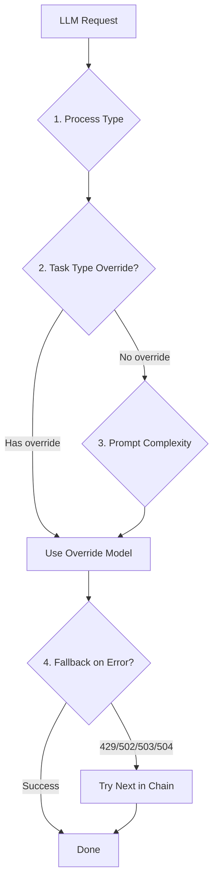

Spacebot's routing system picks the right model for every LLM call. Channels get the best conversational model. Workers get something fast and cheap. Compactors get the cheapest tier. Coding workers upgrade to stronger models automatically.

## Four-Level Routing



### Level 1: Process-Type Defaults

Each process type has a default model:

```rust
// From src/llm/routing.rs
pub struct RoutingConfig {
    pub channel: String,     // Best conversational model
    pub branch: String,      // Same, needs reasoning
    pub worker: String,      // Fast and cheap
    pub compactor: String,   // Cheapest tier
    pub cortex: String,      // Cheap bulletin generation
}
```

Example config:

```toml
[defaults.routing]
channel = "anthropic/claude-sonnet-4"
branch = "anthropic/claude-sonnet-4"
worker = "anthropic/claude-haiku-4.5"
compactor = "anthropic/claude-haiku-4.5"
cortex = "anthropic/claude-haiku-4.5"
```

### Level 2: Task-Type Overrides

Workers and branches can override their model based on task type:

```rust
// From src/llm/routing.rs
pub task_overrides: HashMap<String, String>
```

Example:

```toml
[defaults.routing.task_overrides]
coding = "anthropic/claude-sonnet-4"  # Upgrade coding workers
research = "openai/gpt-4.1"           # Specialized research model
```

When spawning a worker:

```json
{
  "name": "spawn_worker",
  "input": {
    "task": "Refactor authentication module",
    "task_type": "coding",  // Triggers task override
    "worker_type": "interactive"
  }
}
```

The worker uses `anthropic/claude-sonnet-4` instead of the default `anthropic/claude-haiku-4.5`.

### Level 3: Prompt Complexity Scoring

<Info>
  Prompt complexity scoring is optional and defaults to disabled. Enable it per process type.
</Info>

When enabled, incoming user messages are scored and routed to cheaper models automatically:

```toml
[defaults.routing.prompt_routing]
enabled = true
process_types = ["channel", "branch"]
```

A lightweight keyword scorer classifies messages into three tiers:

**Light (0-33)** — Greetings, simple questions, acknowledgments
- "hey"
- "thanks"
- "what's up?"

**Standard (34-66)** — Normal requests, moderate complexity
- "explain how X works"
- "help me debug this"

**Heavy (67+)** — Complex tasks, multi-step reasoning
- "refactor the entire auth system"
- "research best practices for..."
- "analyze this codebase and..."

The router downgrades light/standard requests:

```rust
// Pseudocode
if score < 34 {
    use_model("anthropic/claude-haiku-4.5");  // Cheap
} else if score < 67 {
    use_model("anthropic/claude-sonnet-4");   // Balanced
} else {
    use_model("anthropic/claude-opus-4");     // Premium
}
```

<Note>
  Scoring runs on the **user message only**. System prompts, identity files, and context are excluded. Takes less than 1ms with no external calls.
</Note>

### Level 4: Fallback Chains

When a model returns 429 (rate limit) or 502/503/504 (server errors), the next model in the chain takes over:

```toml
[defaults.routing.fallbacks]
"anthropic/claude-sonnet-4" = ["anthropic/claude-haiku-4.5"]
"openai/gpt-4.1" = ["openai/gpt-4.1-mini", "anthropic/claude-haiku-4.5"]
```

Fallback triggers:

```rust
// From src/llm/routing.rs
pub fn is_retriable_status(status: u16) -> bool {
    matches!(status, 429 | 502 | 503 | 504)
}

pub fn is_retriable_error(error_message: &str) -> bool {
    let lower = error_message.to_lowercase();
    lower.contains("429")
        || lower.contains("rate limit")
        || lower.contains("overloaded")
        || lower.contains("timeout")
        // ...
}
```

## Rate Limit Tracking

When a model returns 429, it's deprioritized system-wide:

```toml
[defaults.routing]
rate_limit_cooldown_secs = 60  # Default cooldown
```

During cooldown, all agents skip that model and use fallbacks.

## Routing Profiles

Presets that shift what models each tier maps to:

### Eco Profile

```toml
[defaults.routing]
profile = "eco"

# Light messages route to free/cheap models
# Standard messages use haiku
# Heavy messages use sonnet
```

### Balanced Profile (Default)

```toml
[defaults.routing]
profile = "balanced"

# Light messages use haiku
# Standard messages use sonnet
# Heavy messages use opus
```

### Premium Profile

```toml
[defaults.routing]
profile = "premium"

# Light messages use sonnet
# Standard messages use opus
# Heavy messages use opus with extended thinking
```

## Provider Defaults

Each provider has sane defaults. When you set up OpenRouter but routing still points to `anthropic/...`, calls fail because there's no Anthropic key.

Spacebot auto-detects the provider and sets appropriate defaults:

```rust
// From src/llm/routing.rs
pub fn defaults_for_provider(provider: &str) -> RoutingConfig {
    match provider {
        "anthropic" => RoutingConfig::for_model("anthropic/claude-sonnet-4"),
        "openrouter" => RoutingConfig {
            channel: "openrouter/anthropic/claude-sonnet-4-20250514",
            worker: "openrouter/anthropic/claude-haiku-4.5-20250514",
            // ...
        },
        "openai" => RoutingConfig {
            channel: "openai/gpt-4.1",
            worker: "openai/gpt-4.1-mini",
            // ...
        },
        // ...
    }
}
```

### OpenRouter Example

```toml
[llm]
openrouter_key = "env:OPENROUTER_API_KEY"

[defaults.routing]
channel = "openrouter/anthropic/claude-sonnet-4-20250514"
worker = "openrouter/anthropic/claude-haiku-4.5-20250514"

[defaults.routing.task_overrides]
coding = "openrouter/anthropic/claude-sonnet-4-20250514"

[defaults.routing.fallbacks]
"openrouter/anthropic/claude-sonnet-4-20250514" = [
    "openrouter/anthropic/claude-haiku-4.5-20250514"
]
```

### Kilo Gateway Example

```toml
[llm]
kilo_key = "env:KILO_API_KEY"

[defaults.routing]
channel = "kilo/anthropic/claude-sonnet-4.5"
worker = "kilo/anthropic/claude-haiku-4.5"

[defaults.routing.task_overrides]
coding = "kilo/anthropic/claude-sonnet-4.5"
```

### Z.ai (GLM) Example

```toml
[llm]
zhipu_key = "env:ZHIPU_API_KEY"

[defaults.routing]
channel = "zhipu/glm-4.7"
worker = "zhipu/glm-4.7"

[defaults.routing.task_overrides]
coding = "zhipu/glm-4.7"
```

### Ollama Example

```toml
[llm]
ollama_base_url = "http://localhost:11434"

[defaults.routing]
channel = "ollama/gemma3"
worker = "ollama/gemma3"

[defaults.routing.task_overrides]
coding = "ollama/qwen3"
```

### Custom Provider Example

Add any OpenAI-compatible or Anthropic-compatible endpoint:

```toml
[llm.provider.my-provider]
api_type = "openai_chat_completions"  # or "anthropic"
base_url = "https://my-llm-host.example.com"
api_key = "env:MY_PROVIDER_KEY"

[defaults.routing]
channel = "my-provider/my-model"
worker = "my-provider/my-fast-model"
```

Supported `api_type` values:
- `openai_completions`
- `openai_chat_completions`
- `openai_responses`
- `anthropic`

## Resolution Flow

```rust
// From src/llm/routing.rs
impl RoutingConfig {
    pub fn resolve(&self, process_type: ProcessType, task_type: Option<&str>) -> &str {
        // Level 2: Check task-type override
        if let Some(task) = task_type
            && matches!(process_type, ProcessType::Worker | ProcessType::Branch)
            && let Some(override_model) = self.task_overrides.get(task)
        {
            return override_model;
        }

        // Level 1: Process-type default
        match process_type {
            ProcessType::Channel => &self.channel,
            ProcessType::Branch => &self.branch,
            ProcessType::Worker => &self.worker,
            ProcessType::Compactor => &self.compactor,
            ProcessType::Cortex => &self.cortex,
        }
    }
}
```

## Thinking Effort

For models that support extended thinking (Claude Opus, o1), configure effort per process type:

```toml
[defaults.routing]
channel_thinking_effort = "auto"
branch_thinking_effort = "medium"
worker_thinking_effort = "low"
compactor_thinking_effort = "low"
cortex_thinking_effort = "auto"
```

Values: `"auto"`, `"low"`, `"medium"`, `"high"`

Thinking effort is passed to the provider:

```rust
// From src/llm/model.rs
let thinking_effort = routing.thinking_effort_for_model(model_name);
```

## Context Overflow Recovery

When a model returns a context overflow error, branches and workers compact and retry:

```rust
// From src/llm/routing.rs
pub fn is_context_overflow_error(error_message: &str) -> bool {
    let lower = error_message.to_lowercase();
    lower.contains("context length")
        || lower.contains("maximum context")
        || lower.contains("token limit")
        || lower.contains("too many tokens")
        // ...
}
```

Branches retry up to 2 times:

```rust
// From src/agent/branch.rs
const MAX_OVERFLOW_RETRIES: usize = 2;

match agent.prompt(&prompt).await {
    Err(error) if is_context_overflow_error(&error.to_string()) => {
        self.force_compact_history();
        current_prompt = "Continue where you left off. Older context has been compacted.";
    }
}
```

Workers retry up to 3 times:

```rust
// From src/agent/worker.rs
const MAX_OVERFLOW_RETRIES: usize = 3;
```

## Multi-Agent Routing

Each agent can have its own routing config:

```toml
[[agents]]
id = "premium-assistant"

[agents.routing]
channel = "anthropic/claude-opus-4"
worker = "anthropic/claude-sonnet-4"

[[agents]]
id = "budget-assistant"

[agents.routing]
channel = "openrouter/anthropic/claude-haiku-4.5-20250514"
worker = "openrouter/google/gemini-flash-1.5"
```

If not specified, agents inherit from `[defaults.routing]`.

## Best Practices

<Accordion title="How to choose models per process type">
  **Channels** — Best conversational model. Users interact directly.
  
  **Branches** — Same as channels. Needs reasoning, context understanding.
  
  **Workers** — Fast and cheap. Most worker tasks are execution, not conversation.
  
  **Compactors** — Cheapest tier. Summarization is a commodity task.
  
  **Cortex** — Cheap. Bulletin generation doesn't need opus-level reasoning.
</Accordion>

<Accordion title="When to use task overrides">
  Use task overrides when:
  - A specific task type needs a stronger model (coding, research)
  - You want to upgrade workers for complex work without upgrading all workers
  - You have specialized models for specific domains
  
  Don't override when:
  - The default worker model is already strong enough
  - You want to minimize costs
</Accordion>

<Accordion title="When to enable prompt complexity scoring">
  Enable prompt scoring when:
  - You have a mix of simple and complex user requests
  - You want to minimize costs by routing simple messages to cheap models
  - You trust the keyword scorer to classify correctly
  
  Disable when:
  - All messages should use the same model
  - You want predictable model selection
  - Your users send mostly complex requests
</Accordion>

<Accordion title="How to configure fallback chains">
  **Single fallback:**
  ```toml
  "anthropic/claude-sonnet-4" = ["anthropic/claude-haiku-4.5"]
  ```
  
  **Multi-level fallback:**
  ```toml
  "openai/gpt-4.1" = [
      "openai/gpt-4.1-mini",
      "anthropic/claude-haiku-4.5"
  ]
  ```
  
  **Cross-provider fallback:**
  ```toml
  "anthropic/claude-sonnet-4" = [
      "openrouter/anthropic/claude-haiku-4.5-20250514"
  ]
  ```
</Accordion>

## Next Steps

<CardGroup cols={2}>
  <Card title="Configuration" icon="gear" href="/configuration/config">
    Full routing configuration reference
  </Card>
  <Card title="Providers" icon="plug" href="/configuration/providers">
    Supported LLM providers
  </Card>
  <Card title="Multi-Agent" icon="users" href="/core/agents">
    Per-agent routing configuration
  </Card>
  <Card title="Workers" icon="hammer" href="/core/agents#workers">
    How workers use routing
  </Card>
</CardGroup>