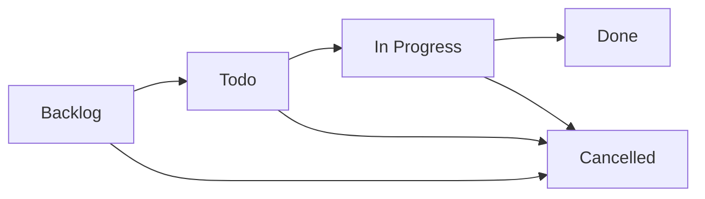

Spacebot includes a built-in task management system for tracking work, priorities, and subtasks. Tasks are stored in SQLite and accessible via LLM tools.

## Why Tasks?

Memories are for knowledge. Tasks are for work:

- **Backlog management**: Track planned features, bugs, and research
- **Worker coordination**: Assign tasks to workers, track progress
- **Context continuity**: Remember what you're working on across sessions
- **Structured workflow**: Prioritize, organize, and check off subtasks

## Task Structure

<ParamField path="task_number" type="integer">
  Auto-incrementing ID unique to the agent
</ParamField>

<ParamField path="title" type="string">
  Short description (e.g., "Fix authentication bug")
</ParamField>

<ParamField path="description" type="string">
  Detailed notes, context, or acceptance criteria
</ParamField>

<ParamField path="status" type="string">
  One of: `backlog`, `todo`, `in_progress`, `done`, `cancelled`
</ParamField>

<ParamField path="priority" type="string">
  One of: `low`, `medium`, `high`, `urgent`
</ParamField>

<ParamField path="subtasks" type="array">
  Checklist items with `{title: string, completed: bool}`
</ParamField>

<ParamField path="metadata" type="object">
  Arbitrary JSON for custom fields
</ParamField>

<ParamField path="source_memory_id" type="string">
  Optional link to the memory that created this task
</ParamField>

<ParamField path="created_by" type="string">
  Process ID that created the task (e.g., `channel:discord:123`, `branch:abc-def`)
</ParamField>

## Creating Tasks

Branches and channels can create tasks via the `task_create` tool:

<Tabs>
  <Tab title="Simple Task">
    ```json
    {
      "title": "Add rate limiting to API",
      "priority": "high"
    }
    ```
  </Tab>
  <Tab title="With Subtasks">
    ```json
    {
      "title": "Deploy v2.0 to production",
      "description": "Full deployment checklist for major release",
      "priority": "urgent",
      "subtasks": [
        "Run full test suite",
        "Update changelog",
        "Tag release in git",
        "Deploy to staging",
        "Run smoke tests",
        "Deploy to production",
        "Monitor logs for 1 hour"
      ],
      "status": "todo"
    }
    ```
  </Tab>
  <Tab title="With Metadata">
    ```json
    {
      "title": "Investigate performance regression",
      "priority": "medium",
      "metadata": {
        "component": "memory_search",
        "reported_by": "user_123",
        "severity": "p2"
      }
    }
    ```
  </Tab>
</Tabs>

The tool returns the task number:

```json
{
  "success": true,
  "task_number": 42,
  "status": "backlog",
  "message": "Created task #42: Add rate limiting to API"
}
```

## Listing Tasks

Query tasks with filters:

<CodeGroup>
```json All Tasks
{}
```

```json By Status
{
  "status": "in_progress"
}
```

```json By Priority
{
  "priority": "high",
  "limit": 20
}
```

```json Multiple Filters
{
  "status": "todo",
  "priority": "urgent"
}
```
</CodeGroup>

Returns task summaries:

```json
{
  "success": true,
  "tasks": [
    {
      "task_number": 42,
      "title": "Add rate limiting to API",
      "status": "in_progress",
      "priority": "high",
      "subtasks_completed": 2,
      "subtasks_total": 5,
      "created_at": "2026-02-28T10:00:00Z",
      "updated_at": "2026-02-28T14:30:00Z"
    }
  ],
  "count": 1
}
```

## Updating Tasks

Workers and branches can update task status, priority, and subtasks:

<Tabs>
  <Tab title="Change Status">
    ```json
    {
      "task_number": 42,
      "status": "done"
    }
    ```
  </Tab>
  <Tab title="Complete Subtasks">
    ```json
    {
      "task_number": 42,
      "subtask_updates": [
        {"title": "Run full test suite", "completed": true},
        {"title": "Update changelog", "completed": true}
      ]
    }
    ```
  </Tab>
  <Tab title="Bump Priority">
    ```json
    {
      "task_number": 42,
      "priority": "urgent"
    }
    ```
  </Tab>
  <Tab title="Add Description">
    ```json
    {
      "task_number": 42,
      "description": "Use a token bucket algorithm. Rate limit is 100 req/min per IP."
    }
    ```
  </Tab>
</Tabs>

## Worker Assignment Pattern

You can assign tasks to workers by storing the worker ID in metadata:

<Steps>
  <Step title="Create Task">
    ```json
    {
      "title": "Fix authentication bug",
      "status": "in_progress",
      "metadata": {"assigned_worker": "worker-abc-123"}
    }
    ```
  </Step>
  <Step title="Worker Updates Progress">
    The worker calls `task_update` as it works:
    ```json
    {
      "task_number": 42,
      "subtask_updates": [
        {"title": "Reproduce issue", "completed": true}
      ]
    }
    ```
  </Step>
  <Step title="Mark Complete">
    ```json
    {
      "task_number": 42,
      "status": "done"
    }
    ```
  </Step>
</Steps>

Workers have access to `task_update` in their tool set. You can scope it to only allow updating tasks assigned to that worker.

## Status Workflow

Tasks flow through these states:



<AccordionGroup>
  <Accordion title="backlog">
    Initial state. Tasks waiting to be prioritized.
  </Accordion>
  <Accordion title="todo">
    Ready to work on. Prioritized and clarified.
  </Accordion>
  <Accordion title="in_progress">
    Actively being worked on. Typically only a few tasks should be in this state at once.
  </Accordion>
  <Accordion title="done">
    Completed. Stays in the database for reference.
  </Accordion>
  <Accordion title="cancelled">
    Abandoned or deprioritized. No longer relevant.
  </Accordion>
</AccordionGroup>

## Storage

Tasks live in the `tasks` table:

```sql
CREATE TABLE tasks (
    id TEXT PRIMARY KEY,
    agent_id TEXT NOT NULL,
    task_number INTEGER NOT NULL,
    title TEXT NOT NULL,
    description TEXT,
    status TEXT NOT NULL,
    priority TEXT NOT NULL,
    subtasks TEXT NOT NULL,  -- JSON array
    metadata TEXT NOT NULL,  -- JSON object
    source_memory_id TEXT,
    created_by TEXT NOT NULL,
    created_at TEXT NOT NULL,
    updated_at TEXT NOT NULL,
    UNIQUE(agent_id, task_number)
);
```

Task numbers auto-increment per agent. Each agent has its own task sequence starting from 1.

## API Access

You can also manage tasks via the HTTP API:

<CodeGroup>
```bash Create
curl -X POST http://localhost:3000/api/agents/spacebot/tasks \
  -H "Content-Type: application/json" \
  -d '{
    "title": "Add rate limiting",
    "priority": "high"
  }'
```

```bash List
curl http://localhost:3000/api/agents/spacebot/tasks?status=in_progress
```

```bash Update
curl -X PATCH http://localhost:3000/api/agents/spacebot/tasks/42 \
  -H "Content-Type: application/json" \
  -d '{"status": "done"}'
```

```bash Delete
curl -X DELETE http://localhost:3000/api/agents/spacebot/tasks/42
```
</CodeGroup>

## Integration with Memory

Tasks can link to memories:

1. **Memory → Task**: When a branch identifies work to do, it can save a memory and create a task, linking them via `source_memory_id`.
2. **Task → Memory**: When a task is completed, the worker can save a `decision` memory summarizing what was done, referencing the task number in metadata.

This creates a bidirectional trail between knowledge and execution.

## Best Practices

<CardGroup cols={2}>
  <Card title="Use Subtasks" icon="list-check">
    Break complex tasks into checkable steps. Helps workers report progress and the LLM understand what's left.
  </Card>
  <Card title="Metadata for Context" icon="tag">
    Store component names, issue IDs, user reports, or other structured data in `metadata` for rich filtering.
  </Card>
  <Card title="Status Discipline" icon="arrows-rotate">
    Keep `in_progress` limited. If a task stalls, move it back to `todo` or `backlog`.
  </Card>
  <Card title="Priority Hygiene" icon="fire">
    Only mark truly time-sensitive work as `urgent`. Use `high` for important but not blocking.
  </Card>
</CardGroup>

<Warning>
  **Don't use tasks for knowledge.** If it's a fact, preference, or decision, use a memory. Tasks are ephemeral work items. Memories are long-term knowledge.
</Warning>
